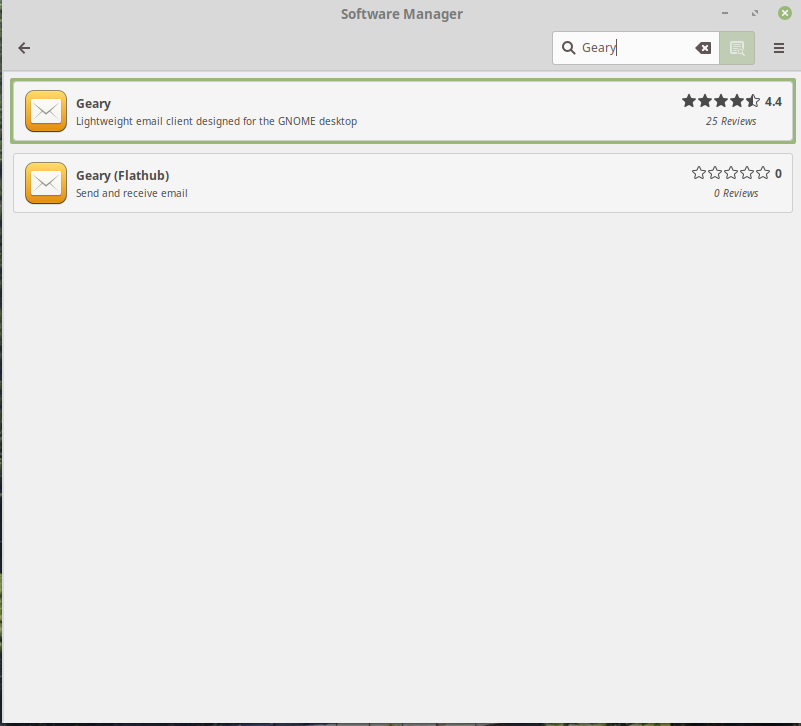

## 2.1 Managing Software

This section consists of three subsections: installing, updating, and removing software from your computer. In each subsection there will be a screen shot and instructions. All screen shots are from a fresh install of Linux Mint Cinnamon 19.

### 2.1a Installing Software

There are several ways to install software in Linux Mint. The two most important ways are through the Software Manager, and through the Synaptic Package Manager. Since the Synaptic Package Manager can be complicated in the beginning, we'll come back to this method later on in the book. Many applications that you will use can be installed through the Software Manager. Let's look at how to install software this way.

#### Installing Software through the Software Manager

To get started, click on the menu at the bottom left of your screen. 
 
Now, hover your mouse over "Administration", and then click on "Software Manager"

The software manager will open, and present you with a home screen, giving you access to the most popular applications. The software manager is very similar to Google Play and the Windows Store. 

At the top, you will see a back button, a search bar, and a hamburger menu (the icon with three horizontal lines). When you type a search term into the search bar, you will see search results for that term. For example, if you type "Geary" into the search bar without the quotes, then you will see results, like this: 

Now, both results look the same. They both have the same icon, and contain similar descriptions. However, you will notice that one says **Geary**, and the other says **Geary (Flathub)**. The difference is the source of the software. Both will deliver the same/similar software, but whenever a software listing contains **(Flathub)**, it means that the software is downloaded from a website called flathub.org. Flathub.org is associated with a type of universal Linux package call *Flatpak* that will run on many different Linux distributions. However, sometimes it is not simple to manage Flatpak packages without venturing into the command line; therefore for a beginner it is best to click on the first listing. Clicking on it brings you to the application listing.

The application listing has a lot of information about the application. To the right is a green install button that allows you to install the application if you would like. Below that is a description, then a link to the website of the application. Below that, there is information about the application, like its name, version, and amount of storage it will take up on your disk (this would be 6.9MB of disk space). Furthermore, there are reviews of the application, albeit not in just one language.

To install this application, press "Install." In a few moments, you will be asked for your password, since in Linux Mint (and other Linux distrbutions), to access files and folders required to install programs you need to provide administrator (root) privileges, and this requires your password.

Once your password is typed in, press "Authenticate." You do not need to worry about the "Details" collapsible box.

After a short while of installing, 

Your application will be installed.

There are two ways to launch the application once you install it. The first way is to press the "Launch" button in the top-right of the Software Manager. The second way involves the Menu button at the bottom right of the screen. Furthermore, this method of launching an application is universal to  launching *any* application on the computer, whether you installed it, or it came pre-installed with your computer.

Let's get started with this. First, click on the "Menu" icon at the left of the bar at the bottom of your computer.

 

You will see a menu pop up, like this: 

At the top, you will see a search bar. Click on the search bar, then type in the name of the application you have just installed (In this case it is Geary).

You will see the application's icon show up. Click on the icon, and the application will launch.

In this case you will see Geary launching for the first time, except behind the previously opened window, which is the Software Manager. Let's take a look at how to close a window while we're at it.

First, let's take a look at the top-right hand corner of (almost) any window, where there will be a minimize, maximize, and close button.

